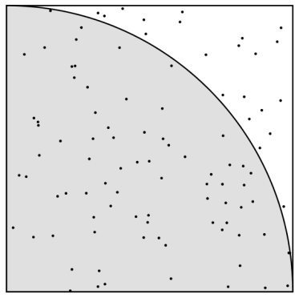

# **Pi Estimation**

Imagine a square dartboard with sides of length 1 and with a
quadrant of a circle drawn in it. Suppose I throw a large number N of darts at the dartboard, and suppose C of them land inside the circle quadrant. Assuming the darts land at random positions, the ratio C/N should be approximately the same as the ratio of the circle quadrant’s area = π/4 to the dart-
board’s area = 1:

<center><h4> C/N ≈ π/4, or π ≈ 4C/N.</h4></center>

<center></center>

It would look something like this.

## **Sequential Program**

The program's command line arguments are the the seed for the pseudo random number generator(prng) and the number of darts to throw on the board and the program will output the calculation of
<center>(4 * Number of darts that fall inside the circle quadrant) / (total number of darts thrown) ≈ pi</center>

```
$ javac src/main/java/edu/rit/cs/Pi_Seq.java<br>
$ java edu.rit.cs.Pi_Seq 142857 12000000000<br>
pi = 4*9424753723/12000000000 = 3.141584574
```


## **Multi-thread Program**
A sequential and parallel program have been written in [OpenMP](http://www.omp4j.org/) for java.


```
$ java -jar [path_openmp_jar] src/main/java/edu/rit/cs/Pi_Smp.java<br>
$ java -cp class edu.rit.cs.Pi_Smp 142857 12000000000<br>
pi = 4*9424753723/12000000000 = 3.141584574
```


## **Multi-node Program**


If you experienced this problem, the running environment cannot locate the native library.
```
Exception in thread "main" java.lang.UnsatisfiedLinkError: no mpi_java in java.library.path
	at java.lang.ClassLoader.loadLibrary(ClassLoader.java:1867)
	at java.lang.Runtime.loadLibrary0(Runtime.java:870)
	at java.lang.System.loadLibrary(System.java:1122)
	at mpi.MPI.<clinit>(MPI.java:206)
```

Add the following as VM Option
```
-Djava.library.path=/usr/local/lib
```

## **Apache Spark Program**

```
mvn compile; mvn package
mvn exec:java -Dexec.mainClass=edu.rit.cs.Pi_Spark
```